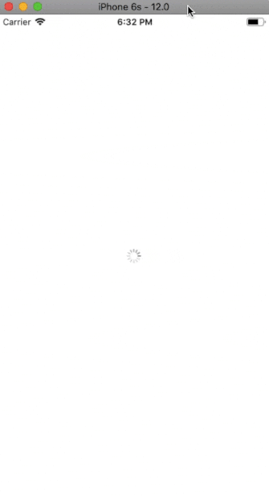

# KotlinMultiplatformSample

### This repo is demonstrative sample project of **Kotlin** multiplatform

It contains a sample project for **IOS** and **Android** and the **Shared** module.
The app shares business logic for both **IOS** and **Android** app, it just gets popular films list from TraktTv and Omdb API.
All the rest **calls**, **parsings** and **mappings** encapsulated inside a shared module

**Android** and **IOS** apps just implement view interfaces and make his own realisations for UI.

Project structure diagram below

| Android     | Ios     |
| :-------------: | :-------------: |
|  | 

### Contact :book:

:arrow_forward:  **Email**: chatikyana@gmail.com

:arrow_forward:  **Medium**: https://medium.com/@chatikyan

:arrow_forward:  **Twitter**: https://twitter.com/ArmanChatikyan

:arrow_forward:  **Google+**: https://plus.google.com/+ArmanChatikyan

:arrow_forward:  **Website**: https://armcha.github.io/

License
--------

      KotlinMultiplatformSample
      Copyright (c) 2018 Arman Chatikyan (https://github.com/armcha/KotlinMultiplatformSample).

      Licensed under the Apache License, Version 2.0 (the "License");
      you may not use this file except in compliance with the License.
      You may obtain a copy of the License at

         http://www.apache.org/licenses/LICENSE-2.0

      Unless required by applicable law or agreed to in writing, software
      distributed under the License is distributed on an "AS IS" BASIS,
      WITHOUT WARRANTIES OR CONDITIONS OF ANY KIND, either express or implied.
      See the License for the specific language governing permissions and
      limitations under the License.
 
