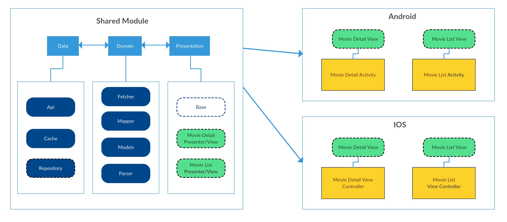

# KotlinMultiplatformSample

### This repo is demonstrative sample project of **Kotlin** multiplatform

It contains a sample project for **IOS** and **Android** and the **Shared** module.
The app shares business logic for both **IOS** and **Android** app, it just gets popular films list from TraktTv and Omdb API.
All the rest **calls**, **parsings**, **mappings** encapsulated inside a shared module

**Android** and **IOS** apps just implement view interfaces and make his own realisations for UI.

Project structure diagram below

